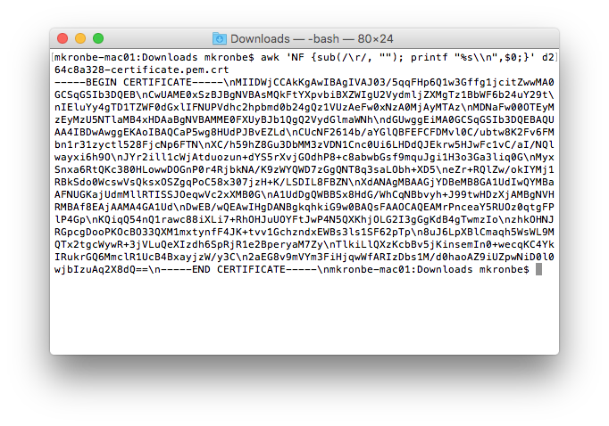

[AWS Alliance Workshop](https://github.com/SSG-DRD-IOT/Alliance-AWS-Workshop) > [Arduino Create AWS PubSub Lab](lab-arduino-create-aws-pub-sub.md)

# Arduino Create - AWS Pub/Sub Lab

This lab will walk you through setting up a basic data connection between your UP2 Board and AWS IoT using Arduino Create. 

### Prerequisites
You will need to have completed the following steps:
*	Setup UP2 board
*	Connect UP2 board to Arduino Create 
*	Complete the [Sensors and Actuators](https://ssg-drd-iot.github.io/toc-sensors)
* Complete the [AWS IoT Setup](https://ssg-drd-iot.github.io/lab-aws-iot)

## Load Pub/Sub Example 

Arduino Create has the AWS IoT Device SDK buit in. You will use this SDK to connect your UP2 board to AWS IoT. We will be editing the Pub/Sub example.

Load the example through Examples -> From Libraries -> AWS IoT Device SDK -> PubSub


## Configure Pub/Sub Endpoint

You will need to change the **ENDPOINT, CLIENT_ID, and THING_NAME** on lines 43-45 to those given to you by AWS IoT. To find the **ENDPOINT** navigate to the AWS Console -> AWS IoT -> Manage -> Things 


Select the Thing that you configured and naviagte to **Interact**. The rest API endpoint is the **ENDPOINT** you will use. Use the name of your Thing as both the **CLIENT_ID and THING_NAME**, in the screen shot above this would be "UP2-Board"  


## Configure Certificates 

In order to mauthenticate your data connection to AWS IoT you will use the certificates that were generated in the AWS IoT Setup Lab - You should have the following files saved on your host computer: XXX-public.pem.key, XXX-private.pem.key, XXX-certificate.pem.crt, and root-ca.pem 

There are a few ways to load these certificates into your example:
  * Paste the contents directly into the main body of the code
  * Paste the contents into the "secret" tab in the Arduino Create project 
  * Copy the certificate file onto the UP2 board and point to the file location in the main code body

### Paste into Secret Tab

Pasting the certificate directly into your code is not secure if you ever share your code. The secret tab will be blank when you share your code so it is a bit more secure. Before pasting the contents of the certificates they need to be properly formatted. In order to do so run the following command in the directory containing your certificates:

```
awk 'NF {sub(/\r/, ""); printf "%s\\n",$0;}' your-certificate.crt
```



Run this command on XXX-private.pem.key, XXX-certificate.pem.crt, and root-ca.pem and paste the outputs into the appropriate boxes in the secret tab. 


### Upload to UP2 Board

instead you can upload your certificates to the UP2 board directly and then point to the files in your code. **You do not need to paste into the secret tab and upload the certificates**. To do this use **scp** from the command line, or any other file transfer program you are familiar with. To use **scp** open a terminal and enter the following commands inside the directory with your certificates:

```
scp -r XXX-private.pem.key upsquared@IP.OF.UP2.Board:/home/upsquared
```

Do this for XXX-certificate.pem.crt and root-ca.pem as well - this will transfer the certificates onto the UP@ board to the /home/upsquared directory. 

You need to now edit **DEFAULTSAMPLECONFIG** on line 52 of the main code to point the code to the correct file locations. 
change:

```
\"root_ca_relative_path\": \"rootCA.pem\",  \"device_certificate_relative_path\": \"34534543-certificate.pem.crt\",  \"device_private_key_relative_path\": \"234234234-private.pem.key\",
```

to 

```
\"/home/upsquared/": \"root-ca.pem\",  \"/home/upsquared/": \"XXX-certificate.pem.crt\",  \"/home/upsquared/": \"XXX-private.pem.key\",
```

Make sure to enter the correct certificate names!

## Run Pub/Sub example

Now you can run your Pub/Sub Example.

First go to the AWS IoT Console, Open the MQTT Test Client and enter "#" as the subsription topic. "#" means "all topics".


Go back to your Arduino Create environment and open the Serial Monitor on the left hand panel. The monitor will give you output from the Pub/Sub example. 


Upload and run your code. 

Go back to the AWS IoT MQTT Client. If everything worked properly you should see the following messages in the message queue:


The Pub/Sub example published "Hello from SDK" to the "/sdk/test/cpp" topic. You can send any JSON data this way to any AWS IoT Topic. 

## Send Sensor Data to AWS IoT

Now that you have a good feel for how to send data up to AWS IoT lets replace "Hello from SDK" with some sensor readings.

Refer back to examples in **Examples -> From Libraries -> UP Squared Grove IoT Kit** to get sample code for reading in sensor data. 

We will use **GroveRotaryAngle** example code to send rotary angle values up to AWS IoT.

**You should still have the Grove Rotary Angle sensor plugged into your UP2 Board**

### Set Pins

Go to your PubSub example code. You will be changing this code in order to have it continuously send rotary angle data to AWS IoT. 

The first thing to add are the pin definitions, add the following lines to the top of the code block:

```C++
int sensorPin = 512;     
int sensorValue = 0;
```

Next add the following definitions inside the **void setup()** loop on line 278

```C++
  // add the Grove Pi+ sub-platform
  mraa_add_subplatform(MRAA_GROVEPI, "0");
```

Now change the "Hello from SDK" string to the analog sensor value. Change:

```C++
util::String payload = "Hello from SDK : ";
```

to 

```C++
util::String payload = std::to_string(analogRead(sensorPin));
```

also delete:

```C++
payload.append(std::to_string(itr));
```
At the end of this **do** loop there is: 

```C++
while (++itr <= msg_count && (ResponseCode::SUCCESS == rc || ResponseCode::ACTION_QUEUE_FULL == rc));
```

To keep the code publishing data continuously change this line to:

```C++
while (ResponseCode::SUCCESS == rc || ResponseCode::ACTION_QUEUE_FULL == rc);
```

Finally you should reduce the rate at which the code publishes to AWS IoT. At the bottom of the code block change:

```C++
void loop(){
  delay(100);
}
```

to

```C++
void loop(){
  delay(500);
}
```
